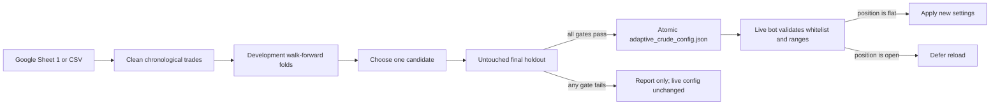

# Adaptive Crude Optimization

## System flow



The optimizer changes the existing Crude rules; it does not place orders and it does not create a second strategy. The live engine accepts only approved, schema-versioned parameters from a strict whitelist.

## What is optimized

- Entry gates: minimum entry volume, minimum absolute OI change, ATR range, and allowed market regimes.
- Risk rules: dynamic ATR multiplier, ATR buffer, risk-reward ratio, and trailing activation.
- Risk candidates are replayed after at least 40 development trades contain `Intratrade Option Prices`, valid entry prices, and ATR. Otherwise those four risk values remain at the current configured defaults. ATR/regime gates also stay disabled until at least 40 usable values exist. This prevents fabricated counterfactual results while retaining legacy rows for volume/OI optimization.

New trades now log `Intratrade Option Prices` and `Entry Momentum Strength`. These fields let replay use the same dynamic ATR and trailing formulas as live execution. Historical rows remain usable for entry-filter optimization.

## Validation policy

Trades are sorted by entry timestamp. The oldest 80% is the development set and is evaluated through expanding chronological walk-forward test folds. Candidate thresholds are derived from the earliest development window. The newest 20% is an untouched holdout and is evaluated once, after candidate selection.

Publishing requires all of the following:

- Enough selected trades in every development fold and the holdout.
- Development and holdout win rate at or above the requested target (default 60%).
- Positive development and holdout PnL.
- Holdout profit factor of at least 1.10.

A 60% historical win rate is a deployment gate, not a guarantee of future accuracy. If no candidate passes, the command exits with code 2 and leaves the existing live JSON untouched.

## Run from Google Sheets

From the `algo_project` directory, while the market is closed:

```powershell
python -m scripts.optimize_crude_parameters
```

The existing `service_account.json` or `GOOGLE_JSON_KEY` credentials are used. Output:

- `data/adaptive_crude_report.json`: audit report for every run.
- `data/adaptive_crude_config.json`: written only after approval.

## Run from CSV

```powershell
python -m scripts.optimize_crude_parameters --csv .\data\crude_trades.csv
```

Required columns are `Entry Timestamp`, `PnL`, `Entry ATR`, `Entry Volume`, `Entry OI_Change`, and `Entry Market Regime`. `Entry Price`, `Intratrade Option Prices`, and `Entry Momentum Strength` enable risk replay.

Useful controls:

```powershell
python -m scripts.optimize_crude_parameters --target-win-rate 0.60 --folds 4 --min-trades-per-fold 5
```

## Daily or weekly automation

Use Windows Task Scheduler to run the module after MCX closes. Set **Start in** to the absolute `algo_project` directory and use the virtual environment's `python.exe` as the program. For weekly optimization, schedule Sunday once per week. For daily optimization, schedule after 23:40 IST.

The optimizer writes through a temporary file plus `os.replace`, so the bot never reads partial JSON. The bot checks for updates during live cycles, rejects invalid values without stopping, and applies approved changes only when no position is open.

Before enabling real orders, collect enough fresh path-enabled paper trades, inspect the holdout report, and keep `execution_mode=PAPER` during a shadow-validation period.